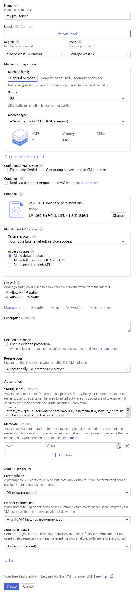

<!-- PROJECT SHIELDS -->
<!--
*** I'm using markdown "reference style" links for readability.
*** Reference links are enclosed in brackets [ ] instead of parentheses ( ).
*** See the bottom of this document for the declaration of the reference variables
*** for contributors-url, forks-url, etc. This is an optional, concise syntax you may use.
*** https://www.markdownguide.org/basic-syntax/#reference-style-links
-->
[![Contributors][contributors-shield]][contributors-url]
[![Forks][forks-shield]][forks-url]
[![Stargazers][stars-shield]][stars-url]
[![Issues][issues-shield]][issues-url]
[![MIT License][license-shield]][license-url]

 

  <h3 align="center">Easy Cloud Video-Meeting Setup (Using Jitsi and GCP)</h3>

<!-- TABLE OF CONTENTS -->

  
Table of Contents

  <ol>
    <li><a href="#about-the-project">About The Project</a></li>
    <li><a href="#prerequisites">Prerequisites</a></li>
    <li><a href="#setup">Setup</a></li>
    <li><a href="#acknowledgements">Acknowledgements</a></li>
  </ol>

<!-- ABOUT THE PROJECT -->
## About The Project
This project is designed to allow even a complete newcomer to set up their own private zoom-like video-meeting server in the cloud, accessible via a webaddress of their choice.

## Prerequisites
Before we start you will need to:

<ol>
    <li><a href="https://www.dynu.com/en-US/ControlPanel/CreateAccount">Register with dynu</a></li>
    <li><a href="https://console.cloud.google.com/freetrial/signup/">Register with google cloud</a> - you will need a google/gmail account to do this, you can set it up at the same time. Use the free trial if possible.</li>
</ol>
    

## Setup
### Setup Part 1: Register a dynamic web-address with dynu
By the end of this section we need 3 things set up and noted down:
* Our dynu login username
* Our dynu IP update password
* A web-address for our cloud server

 

1. If you haven't already, <a href="https://www.dynu.com/en-US/ControlPanel/Login">log in to dynu.com here</a>
2. Click "Create Instance" at the top of the page.
3. Note down the web-address/domain you created, <a href="https://www.dynu.com/en-US/ControlPanel/DDNS">you can find it in the list here</a>
4. <a href="https://www.dynu.com/en-US/ControlPanel/ManageCredentials">Create an IP Update password here,</a> don't forget to keep to a note of it.

 

### Setup Part 2: Spin up our video-call cloud server
By the end of this section we should have a server up and running. If you are not on a free trial this will cost you money, but you have to specifically set up a billing account before you can be charged, and google will tell you before you do anything that costs money.

 

1. Go to google cloud and navigate to the "Compute Engine" either by using the search bar at the top of the page or <a href="https://console.cloud.google.com/compute">clicking the link here.</a> The first time you do this, it will take a few minutes to start up.
2. Once it's ready, click "Create" or "Create Instance"
3. Configure your virtual machine as follows. You can compare your settings to mine in the image included below.
    * Give your virtual machine a name
    * Choose a region for the virtual machine. Select one close to you, I chose europe-west2 (London)
    * Choose your machine configuration. This determines how powerful your virtual machine is. I usually choose Series: E2, Machine type: e2-standard-2. This has 2 vCPU's and 8GB Memory and should be powerful enough for 8-10 people to use in a meeting. Make your machine more powerful if you want to host more people.
    * In the firewall section, check "Allow HTTP" and "Allow HTTPS" - without this we would not be able to access your virtual machine via the web
    * Finally, click the dropdown labelled "Management, security, disks, networking, sole tenancy", then under "Startup Script" paste the following:

            curl -s -L https://raw.githubusercontent.com/myx360/jitsi/main/jitsi_startup_script.sh -o startup.sh && sudo bash startup.sh
    

4. When your build is configured, hit "Create" at the bottom of the page.
5. Once your virtual machine has finished building and has a green icon next to it, click on the SSH button. A new window will appear. After it loads and you can type into it, enter the following code below and press enter. This will ask you for the details you saved earlier and then install your jitsi server, which takes a few minutes.

       curl -s -L https://raw.githubusercontent.com/myx360/jitsi/main/jitsi_setup_script.sh -o setup.sh && sudo bash setup.sh
6. Once the script has finished running, visit the web-address you created and you should find your jitsi server running.

### Setup Part 3: Stopping our video-call server
Don't forget to switch off your jitsi server to save credits/money. Go to https://console.cloud.google.com/compute/instances and click on the three dots next to your running virtual machine instance. This will give you the option to stop your virtual machine (and start it up again when you want it).

 

<!-- ACKNOWLEDGEMENTS -->
## Acknowledgements
* [Google Cloud Platform (GCP)](https://cloud.google.com/)
* [Jitsi-meet](https://meet.jit.si/)
* [Best-README-template](https://github.com/othneildrew/Best-README-Template/blob/master/README.md)
* [shields.io](https://shields.io)
* [Choose an Open Source License](https://choosealicense.com)
* [GitHub Pages](https://pages.github.com)
* [Animate.css](https://daneden.github.io/animate.css)
* [Loaders.css](https://connoratherton.com/loaders)
* [Slick Carousel](https://kenwheeler.github.io/slick)
* [Smooth Scroll](https://github.com/cferdinandi/smooth-scroll)
* [Sticky Kit](http://leafo.net/sticky-kit)
* [JVectorMap](http://jvectormap.com)
* [Font Awesome](https://fontawesome.com)

<!-- MARKDOWN LINKS & IMAGES -->
<!-- https://www.markdownguide.org/basic-syntax/#reference-style-links -->
[contributors-shield]: https://img.shields.io/github/contributors/othneildrew/Best-README-Template.svg?style=for-the-badge
[contributors-url]: https://github.com/myx360/jitsi/graphs/contributors
[forks-shield]: https://img.shields.io/github/forks/othneildrew/Best-README-Template.svg?style=for-the-badge
[forks-url]: https://github.com/myx360/jitsi/network/members
[stars-shield]: https://img.shields.io/github/stars/othneildrew/Best-README-Template.svg?style=for-the-badge
[stars-url]: https://github.com/myx360/jitsi/stargazers
[issues-shield]: https://img.shields.io/github/issues/othneildrew/Best-README-Template.svg?style=for-the-badge
[issues-url]: https://github.com/myx360/jitsi/issues
[license-shield]: https://img.shields.io/github/license/othneildrew/Best-README-Template.svg?style=for-the-badge
[license-url]: https://github.com/myx360/jitsi/blob/master/LICENSE.txt
[vm-config]: images/vm_config.png